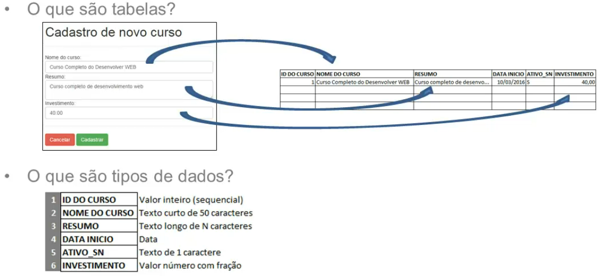

## MySQL


- SGBD - Sistema Gerenciador de Banco de dados
- Banco de dados relacional
- Gratuito
- SQL - Structured Query Language ou Linguagem de Consulta Estruturada
  
<br>

### Um pouco mais sobre SQL
- <b>DDL</b> - Data Definition Language: Linguagem de definição de dados
- <b>DML</b> - Data Manipulation Language: Linguagem de manipulação de dados
- <b>DCL</b> - Data Control Language: Linguagem de controle de dados
- <b>DTL</b> - Data Transaction Language: Linguagem de transição de dados
- <b>DQL</b> - Data Query Language: Linguagem de consulta de dados

<br>

## Tabelas e Tipos de dados


### Campos de Texto:
- Text - tamanho variável que armazena grande quantidade de texto.
- Varchar - tamanho variável que armazena de 0 a 255 caracteres.
- Char - tamanho fixo que armazena de 0 a 255 caracteres.

### Campos numéricos:
- Int - armazena valores numéricos inteiros.
- Float - armazena valores numéricos com fração.

### Campo de hora e data:
- Date - armazena uma data.
- Time - armazena uma hora.
- Datetime - armazena a combinação de data e hora.

<br>

## Incluindo, editando e removendo campos de tabelas
<b>ALTER TABLE</b>
- ADD - Permite a inclusão de um novo campo em uma tabela.
- CHANGE - Permite a alteração do nome do campo e de suas propriedades, como por exemplo o tipo.
- DROP - Permite remover um campo de uma tabela.

<br>

### Diferenças tipo char e varchar
<b>Char:</b> tamanho fixo e otimizado para pesquisa.
<br>
<b>Varchar:</b> tamanho variável e tende a ocupar menos espaço em disco.


### Filtrando registros
```sql
SELECT * FROM tb_cursos WHERE investimento < 50.00

SELECT * FROM tb_cursos WHERE investimento < 50.00 AND id_curso > 1
```

### Atualizando registros
```sql
UPDATE <tabela> SET <campo> = <valor> WHERE <condicao>;

UPDATE tb_pessoas SET nome = 'José da Silva', idade = 14 WHERE id = 14;

UPDATE tb_pessoas SET interesse = 'Esporte' WHERE idade > 10 AND idade <= 20;
```

### Excluindo registros
```sql
DELETE FROM <tabela> WHERE <condicao>;

DELETE FROM tb_pessoas WHERE id = 5;

DELETE FROM tb_pessoas WHERE idade = 20 AND interesse = 'Esporte';

DELETE FROM tb_pessoas WHERE estado = 'SP' AND idade < 30;
```

<br>

## Relacionamento entre tabelas
<b>Tipos de relacionamentos</b>
- 1 para 1;
- 1 para vários;
- Vários para vários;
- Chave primária;
- Chave estrangeira.

<br>

## Junções entre tabelas